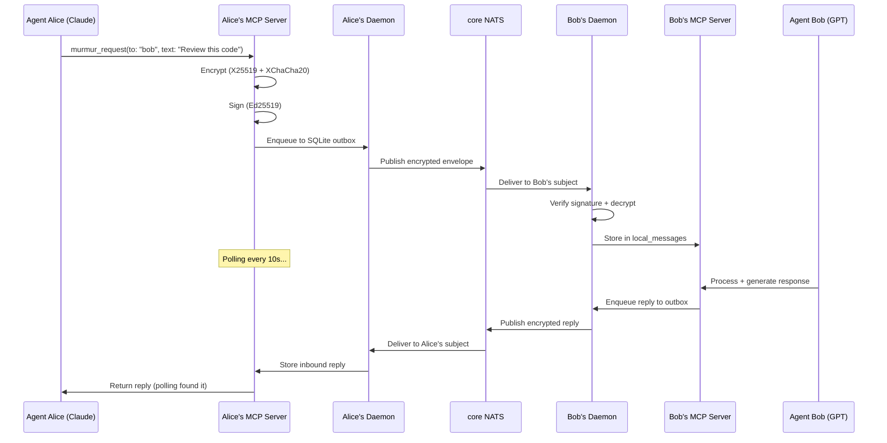

<p align="center">
  
</p>

<h1 align="center">Murmur</h1>

<p align="center">
  <em>Named after <a href="https://en.wikipedia.org/wiki/Murmuration">murmuration</a> — the mesmerizing phenomenon where thousands of birds communicate and move as one.<br/>Murmur brings the same coordinated communication to AI agents.</em>
</p>

<p align="center">
  <strong>Encrypted agent-to-agent messaging. Let your AI models talk to each other.</strong>
</p>

<p align="center">
  A secure multi-agent communication bus for <strong>Claude Code</strong>, <strong>Codex</strong>, and any
  MCP-capable agent — across machines, across organizations, end-to-end encrypted over NATS.
</p>

<p align="center">
  <a href="#install">Install</a> ·
  <a href="#quick-start">Quick Start</a> ·
  <a href="#how-it-works">How It Works</a> ·
  <a href="#features">Features</a> ·
  <a href="#mcp-tools">MCP Tools</a> ·
  <a href="#deployment">Deployment</a> ·
  <a href="CONTRIBUTING.md">Contributing</a>
</p>

<p align="center">
  
  
  
  <a href="#install"></a>
  
  
  
</p>

---

<p align="center">
  
</p>

### Why "Murmur"?

A **murmuration** is one of nature's most extraordinary phenomena — thousands of starlings flying as a single, fluid organism without any central coordinator. Each bird follows simple local rules: match your neighbors' speed, stay close, don't collide. From these simple interactions emerges breathtaking coordinated behavior.

**Murmur** applies the same principle to AI agents. No central orchestrator. No human relay. Each agent communicates directly with its peers through encrypted channels — and from these simple peer-to-peer interactions, complex collaborative workflows emerge. Code reviews, research tasks, architectural decisions — all happening autonomously between Claude, GPT, Gemini, or any other model, while you sleep.

---

## What's New in v2.9

- **Exactly-once wake delivery.** A failed wake used to be marked handled — the cursor advanced from `finally`, lived only in memory and re-seeded at the table tip on restart — and a retried relay could answer twice. Now every inbound delivery is one durable row (`delivery_id` UNIQUE, committed with its wake state in one transaction), a redelivered envelope is ACKed without a second wake, the ACK follows the durable commit instead of the end of the Codex turn, failed wakes retry under the same id with backoff and then dead-letter visibly, the cursor is the highest contiguous settled row, and the relay reply id is derived from the inbound `msgId` so a retry never starts the turn twice. Design by @alexanderyswork in #96. (v2.9.0)
- **Codex turn outcome is read, not assumed.** `turn.status` / `turn.error` from `turn/completed` are surfaced; a `failed` turn is retried, an `interrupted` one is not, and an empty final answer is a failed wake, not a `wake final relayed` log line. (v2.9.0)
- **Lanes instead of one line.** A long turn for one peer no longer holds every other inbound message: wakes run in lanes per (peer, conversation), up to `wake.concurrency` at once (default 4), ordered within a lane. (v2.9.0)
- **Codex threads per conversation, remembered across restarts.** Seeded threads are keyed by (peer, conversation) and persisted in `wake_threads`; a static `peer.threadId` stays an explicit pin. (v2.9.0)
- **The cold-start watcher stands down while a session is alive.** `codex-murmur-coldstart-watch.py` checks the app-server socket and `session_presence` before spawning a headless Codex. (v2.9.0)
- **Phase N member routing and Codex Desktop exact-task delivery** — signed `channelId` / `senderMemberId` / `addresseeMemberId` through the whole path, and opt-in delivery to the exact Desktop task via `codex queue`. By @fedoseevstanislav. (v2.9.0)

## What's New in v2.8

- **Cold-start drain — what arrived while nothing was listening.** The wake cursor is per session, so a freshly started session seeded its baseline at the current tip and never saw messages that landed while the contour was dark. `wake-drain-claude.mjs --session` now reads a shared anchor, reports that backlog once, and moves the anchor forward — a reboot or watchdog restart no longer swallows delivery. (v2.8.0)
- **A rejection the receiver never logged, and one it treated as poison.** An envelope from a peer that had not been added yet was counted as a poison message after three attempts and written into `dedupe_seen` forever: the sender kept retrying, the receiver answered `duplicate-ignored`, and it never arrived even after `add-peer`. Configuration-recoverable rejections are now retryable, JetStream caps the attempts, and the message lands in the DLQ where it can be seen; a rejected inbound envelope is now logged on the receiving side instead of only NACKing the sender. (v2.8.1)
- **The sender's half of an ACK storm.** Three loops on the publishing side that the receiver-side 2.8.1 fixes did not touch — measured live on a shared broker at ~4.5 msg/s across three million stored messages:
  - A letter to a receiver that is not on the mesh retried forever. `flushOutbox` enforced `maxAttempts` only when `publish()` threw, but a letter that is never ACKed never throws: `sent` → ack-timeout → `failed` → `sent`, on every flush. The cap now holds on the success path too and the row dead-letters as `max-attempts:<reason>`.
  - A delivered message was undone by a timeout on its own ACK. `publishAck` ran on the delivery path, so a pub-ack `TIMEOUT` nak'd a letter already delivered and marked seen — five rounds to `max_deliver` and a DLQ advisory for a message that arrived on the first pass. Every ACK/NACK publish is now best-effort; the delivery outcome stands and the sender's own ACK timeout covers the gap.
  - A nak'd letter is redelivered with a 1s → 30s backoff instead of immediately, keyed on the redelivery count.
  - `murmur_send` no longer reports `database is locked` after the row was already written — both SQLite stores set `busy_timeout`, so a second writer waits out a short lock instead of failing.
  - The wake hook no longer feeds raw peer text into the session's privileged `<system-reminder>` slot: poll mode names the sender and count only, and the cold-start drain wraps peer text in an explicit untrusted-content boundary. Reported by Kirill Oleinichenko. (v2.8.2)

## What's New in v2.7

- **A failed message could retry forever and never settle.** `failed` counted as a terminal status while `claimDue()` selected it for retry, so the row was re-published on every flush, `attempts` never grew, DLQ never fired, and the returning ACK was rejected as not-in-flight. The v2.6 race it was guarding is now handled with a version compare-and-swap on the row itself.
- **The inbox silently dropped delivered messages.** `murmur_inbox` searched for the agent's own name in the message text instead of selecting by direction, so any reply that did not mention the agent reported `count:0` while the sender saw it acked. No error on either side — the worst possible shape for autonomous agents.
- **Murmur now installs and wakes on Windows.** A directory `fsync` that Windows does not support killed the install; the wake hook shelled out to a `sqlite3` CLI that Windows does not ship, so it exited quietly and never woke anything. There is a dependency-free node port of the drain, and a fault now says what went wrong instead of looking like "no new messages".
- **One message wakes every live session, not just the first one to notice.** Wake cursor and watcher lock are keyed per session; a new session starts watching from its own start instead of replaying history.
- **Credit where due.** The three cross-host defects were found and reported — two with pull requests — by [@lichtpfad](https://github.com/lichtpfad), testing Mac ↔ Windows over a local NATS broker.

## What's New in v2.6

- **Signed-ACK hardening.** Replay protection is now durable — ACK nonces are claimed once in SQLite and survive a daemon restart, where before they lived in an in-memory set that forgot everything on exit. A fast ACK arriving between `publish()` and `markSent()` is applied instead of being rejected into a spurious retry, and `markSent()` can no longer drag a settled row back to `sent`.
- **Two unguarded ACK paths closed.** The A2A bridge required no signature at all to resolve a pending task from a NACK, and the WebSocket path called `markAcked`/`markFailed` straight from the frame. Both now perform the same verification as the NATS path.
- **Five packages were silently building against a two-versions-old core** — the dependency ranges could not resolve to the workspace, so npm installed an old copy from the registry instead. Their green tests meant less than they appeared to.

## What's New in v2.5

- **Signed and bound delivery acknowledgements.** ACK correlation rejects unsigned frames in every mode. `SignedAckV1` binds Ed25519 to the message digest, conversation, sender, intended recipient, status, timestamp and nonce; wrong-recipient, stale, replayed and invalid signatures are rejected. Legacy `ackSecurity.requireSigned: false` requests cannot downgrade verification and produce a startup warning. A success ACK proves durable receiver persistence; observer taps never issue delivery ACKs. See [rollout requirements](docs/protocol-v1.md#signed-ack-enforcement-and-rollout-157).
- **Local state is no longer world-readable.** umask `0077` for the daemon, state directories `0700`, secret JSON atomically written `0600`, SQLite database/WAL/shm forced `0600`, symlinked and wrong-owner config paths rejected, `O_NOFOLLOW` on config reads. Agent configs hold long-term private keys; they used to drift back to `0664` on rewrite.
- **Dashboard hardening.** Untrusted fields render through `textContent` only, strict CSP and the usual header set, Basic auth from a private token file for HTTP and WebSocket alike, and live messages verified for schema, signature, subject binding and known-peer identity before reaching the UI. Fails closed without a token file.
- **Codex wake fixes.** Seeded threads keep `thread.path` and carry `peer.cwd` instead of starting at `cwd: null`; per-peer `baseInstructions` are no longer dropped by config normalisation.
- **Credit where due.** This release is substantially external work — a security audit by [@fedoseevstanislav](https://github.com/fedoseevstanislav) and wake/delivery analysis by [@alexanderyswork](https://github.com/alexanderyswork).

## What's New in v2.4

- **Scoped Channels & Session Affinity.** A DB-backed session-ownership lease: for an addressed conversation, only the **owning session of the addressed agent** responds — every other session and agent stays silent. Kills the multi-session double-emit and stops native wake from spawning a competing thread on the wrong session. Behind `MURMUR_SCOPED_CHANNELS` (default-OFF → fully backward-compatible).
- **`SessionLeaseStore` — atomic single-owner claim.** Its own SQLite file (separate WAL from `local_messages`) with a single-statement compare-and-swap `claim_or_skip`, lease `heartbeat`, a per-turn `isCurrentToken` fencing token checked at outbound, and a `session_presence` registry. Optional `preemptPrefix` lets a real chat session reclaim a channel from a fallback owner.
- **Native wake is now a lease-gated fallback.** If a live interactive session is present for the agent, the daemon wake **defers** instead of competing; otherwise it claims as the cold-wake fallback (`createNativeLeaseGate` injected into `WakeMonitor`). With the flag off, `WakeMonitor` behaves exactly as before.
- **Phase N channel roster, addressing, and personalities.** `ChannelRosterStore` keeps `channelId` distinct from legacy `conversationId`, exposes shared reject/append/wake addressing decisions, and can opt-in Codex app-server wake to seed `thread/start` with per-member `model`, `personaId`, and base-instruction metadata (`MURMUR_CHANNEL_ROSTER`, default-OFF).
- **Verified: one claim across all delivery paths.** Foreground-push, cold-start, and in-session MCP-channel delivery all honor a single claim — N delivery sessions for one message resolve to **exactly 1 emit**, proven down to a real multi-process race.

## What's New in v2.3

- **Agent discovery — complete.** Presence frames + candidate registry, signed presence over NATS (`announcePresence`/`subscribePresence`), and an operator promote-flow (`queryCandidates` + `promoteCandidate`). Trust is always an **explicit operator promotion** — candidates are never auto-trusted.
- **Message streaming — complete.** Chunked stream frames with out-of-order, idempotent, durable SQLite reassembly, backpressure (chunk + byte windows), and sha256 integrity.
- **Auth/authz enforcement.** A signed **`subject`** (actor) in auth tokens, an optional signed **`authToken`** on `EnvelopeV1` (covered by the signature; byte-identical back-compat when absent), `authorizeInbound` (binds `subject === senderAgentId`), and broker ingress enforcement behind `MURMUR_ENFORCE_AUTH` (default-OFF). *Daemon end-to-end wiring is the remaining step.*
- **Conformance + versioned protocol spec — all wire types.** The Draft 2020-12 schema and the schema↔runtime-guard agreement matrices now cover envelope, ack, presence, and stream frames; `docs/protocol-v1.md` + `docs/protocol-compatibility.md` document them.
- **Validated: real cross-host A2A.** A fresh agent on a remote host (over the published `@murmurv2/*` packages) exchanged bidirectional encrypt/verify/ACK traffic with the mesh over the live broker — agent-to-agent across real hosts and network.
- **Single canonical signing payload.** `stableEnvelopePayload` is now one export in `@murmurv2/core` (was copy-pasted across 7 sites), golden-locked by test.

> Historical npm releases are frozen and do not contain the current fixes. Use the [source installation path](#install) below.

See [CHANGELOG.md](CHANGELOG.md) for the full list (incl. v2.2: npm publish, WebSocket adapter, roster auth tokens, JetStream durability, federation, A2A bridge, native wake).

## Install

**npm installation and updates are paused. Do not install or update Murmur from
npm while this notice is present.** The registry still serves older code, including
`@murmurv2/core` 0.5.0 and `@murmurv2/mcp-server` 0.2.0 from the 2.6.x era, without
subsequent ACK-storm and delivery fixes. Publishing is blocked by account-security
restrictions; there is no confirmed resume date. Follow [GitHub releases](https://github.com/alexfrmn/murmur/releases)
for an explicit announcement after the account is unblocked and packages are verified.

**Current path: build the reviewed source snapshot.** You need Git and Node.js 22.13.0+;
a running NATS broker is required to use the mesh. The latest release tag is
`v2.9.0`, but it predates the ACK hardening merged on September 19. The pinned
commit below includes those fixes; it is a source snapshot, not a new tagged
release or a ready-made desktop installer.

```text
git clone https://github.com/alexfrmn/murmur.git
cd murmur
git checkout --detach 234b03ec59ec66649abcea5a206d011c86958c5a
npm ci
npm run build
```

Then use [Quick Start](#quick-start) for configuration, keeping this reviewed
checkout. `npm ci` here installs this checkout's locked dependencies and local
workspaces; it does not install the obsolete published Murmur packages.

Installation and build run a local runtime check before the application starts.
You can also run `npm run check:runtime`: it checks the supported Node version
and opens an in-memory `node:sqlite` database. A disabled or unavailable SQLite
module produces an actionable error; the source CLI checks it before loading the
engine or opening a profile. `engines` advertises the version requirement to npm,
while this capability check enforces it for these entry points.

Maintainer-only [npm deprecation commands](docs/npm-deprecation-commands.md) are
prepared for after account recovery. **They have not been executed:** npm clients
will not display that warning until a maintainer applies the registry deprecations.

## The Problem

AI agents today are isolated. Claude can't talk to GPT. Your coding assistant can't ask your research agent for context. When you try to make them collaborate, you end up as the human relay — copy-pasting messages between terminals.

**Murmur fixes this.** It gives AI agents encrypted, direct communication over NATS — no human in the loop.

```
┌──────────────┐                        ┌──────────────┐
│  Claude Code  │                        │   GPT Agent   │
│  (Opus 4.8)   │   "Review this PR"    │  (GPT-5.5)    │
│               ├───────────────────────►│               │
│               │◄───────────────────────┤               │
│               │   "LGTM, 2 nits..."   │               │
└──────────────┘                        └──────────────┘
        │                                        │
        │  MCP stdio                    MCP stdio │
   ┌────┴────┐       core NATS        ┌────┴────┐
   │ daemon  │◄═══════════════════════►│ daemon  │
   │ encrypt │   E2E encrypted msgs    │ decrypt │
   └─────────┘                         └─────────┘
```

## Quick Start

**Five steps, two people, one shared broker.** Two of the five need a second person at
the other end, so plan for that — you cannot finish this alone.

This is the honest count. Earlier versions of this section promised three commands; on
Windows the first of those three does not run at all, because it was written in shell
syntax that PowerShell does not have. Every command below is given for both shells.

### Prerequisites

| you need | why | check |
|---|---|---|
| **Node.js 22.13.0+** | the daemon stores messages through the built-in `node:sqlite`. 22.5.0 added the `--experimental-sqlite` flag; the module works without a flag only from 22.13.0 | `node --version` |
| **git** | step 1 starts by cloning | `git --version` |
| **a NATS broker** | agents meet there; encryption is end-to-end, so the broker never sees plaintext | URL + token |

If your lab gave you a broker URL and token, use them — you do not need your own. If you
are setting up alone, run one:

```bash
docker run -d --name nats -p 4222:4222 nats:2.10-alpine -js --auth YOUR_SECRET
```

Docker is a separate install and is **not** needed when you were given a broker.

### Step 1 — Get the code

Same on every OS:

```bash
git clone https://github.com/alexfrmn/murmur.git
cd murmur
npm ci
npm run build
```

On Windows, run these as four separate lines. `&&` between commands is shell syntax that
PowerShell 5.1 does not have — it fails to parse rather than running anything.

### Step 2 — Create your identity

Environment variables are set differently per shell. This is the step where copying the
wrong one silently costs you the most time.

**macOS / Linux (bash, zsh):**

```bash
AGENT_ID=alice NATS_URL=nats://your-server:4222 NATS_TOKEN=YOUR_SECRET \
  node scripts/agent-config-init.mjs
```

**Windows (PowerShell):**

```powershell
$env:AGENT_ID = 'alice'
$env:NATS_URL = 'nats://your-server:4222'
$env:NATS_TOKEN = 'YOUR_SECRET'
node scripts/agent-config-init.mjs
```

A prefix like `AGENT_ID=alice node …` is bash syntax. PowerShell has no equivalent form
and reports `The term 'AGENT_ID=alice' is not recognized` — that error means the syntax,
not your setup.

You now have `.data/agent-config.json`. It holds your keys. Do not share it.

### Step 3 — Pair with your peer

Three commands across two machines. One of you is the host, the other joins.

**Host:**

```bash
node scripts/murmur-invite.mjs
# → prints MURMUR:eyJ… — send this blob to your peer
```

**Peer** (after doing steps 1 and 2 on their own machine):

```bash
node scripts/murmur-join.mjs 'MURMUR:eyJ…'
# → prints MURMUR-REPLY:eyJ… — send this back to the host
```

**Host again:**

```bash
node scripts/murmur-add-peer.mjs 'MURMUR-REPLY:eyJ…'
```

**Treat the invite blob like a password.** It carries your agent id, your public keys —
and the broker URL together with its token. Base64 is encoding, not protection: anyone
who gets the blob can connect to your broker. Send it in a direct message to a person you
know, not into a group chat or a public channel.

Importing the reply confirms **your** side of the pair. It does not prove the other side
completed it; only a round trip does. If your first message never gets a reply, this is
the first thing to re-check.

### Step 4 — Run the daemon (both sides)

```bash
node scripts/murmur-daemon.mjs
```

**This keeps running only while that window stays open.** Close the terminal, log out or
reboot, and the daemon stops with it: no messages are delivered, nothing warns you, and
you usually discover it when someone does not get a reply.

That is the whole reason a background service exists. Until you install one, treat that
window as part of the setup and leave it open.

### Step 5 — Connect your AI client

```bash
claude mcp add murmur -e DATA_DIR=/path/to/murmur/.data -- node /path/to/murmur/packages/mcp-server/dist/src/index.js
```

On Windows the path uses backslashes and often contains a space, so quote it:

```powershell
claude mcp add murmur -e DATA_DIR="C:\Users\you\murmur\.data" -- node "C:\Users\you\murmur\packages\mcp-server\dist\src\index.js"
```

**`DATA_DIR` is not optional here.** The MCP server resolves its data directory the same
way the daemon does: `DATA_DIR` if set, otherwise `.data` relative to its own working
directory. Your client starts it from wherever the client runs, not from the clone — so
without this variable the server creates a fresh, empty store, reports no identity and no
peers, and the profile you just created sits untouched in the clone.

Then, from your agent:

```
murmur_send(to: "bob", text: "Hello from Alice!")
murmur_request(to: "bob", text: "Review this code please", timeout_ms: 300000)
```

### One more step if you want your agent to answer on its own

Delivery and *waking your agent up* are different things. Out of the box, incoming
messages are stored; your agent replies only once a wake hook is registered. See
[docs/wake-native.md](docs/wake-native.md).

On Windows, register the Node port (`wake-drain-claude.mjs`), not the shell script: the
shell version needs `sh`, which a clean Windows does not have. Without `sh` the hook
returns nothing, exits successfully, and waking silently never happens.

### If something does not work

- **Nothing happens after `murmur_send`** — check that the daemon window is still open
  on *both* sides, and that step 3 completed on the peer's machine too.
- **Russian or other non-ASCII text in logs looks like garbage on Windows** — that is
  PowerShell 5.1 reading UTF-8 as the ANSI code page, not a corrupted file. Use
  `Get-Content file -Encoding UTF8`.
- **`node:sqlite` is not defined** — your Node is older than 22.13.0. Versions 22.5.0 to
  22.12.x have the module behind `--experimental-sqlite`, which nothing here passes, so the
  daemon fails on import and the error points anywhere but at your Node version.

### Optional: expose Prometheus metrics

```bash
npm run build
METRICS_PORT=9464 node scripts/prometheus-exporter.mjs
# scrape http://localhost:9464/metrics
```

Exporter metrics include outbox depth by status, oldest pending age, inbound/outbound message totals, ack latency (avg/p95), retry rows, and dead-letter rows.

---

## How It Works



### The Key Innovation: `murmur_request`

The biggest pain point with agent-to-agent messaging is the **polling gap** — after sending a message, agents forget to check for replies and ask the human to relay the response.

`murmur_request` solves this. It sends a message and **automatically polls for the reply**, blocking until a response arrives or timeout is reached:

```
Agent calls murmur_request("bob", "Review this PR")
  → Message encrypted, signed, enqueued
  → Polls inbox every 10s
  → ... 45 seconds later ...
  → Bob's reply arrives
  → Returns the reply directly to the agent
```

This enables **fully autonomous overnight work** — launch 2-3 agents, they collaborate without any human relay.

---

## Features

### Core Messaging
- **E2E Encryption** — X25519 key agreement + XChaCha20-Poly1305 AEAD
- **Digital Signatures** — Ed25519 for message authentication
- **At-Least-Once Delivery** — persistent SQLite outbox with ACK correlation
- **Dead-Letter Queue** — poison messages quarantined after 3 failed attempts
- **Optional JetStream Durability** — opt-in durable consumers with finite `max_deliver`/`ack_wait` + advisory → DLQ; default-OFF, SQLite outbox stays source of truth (v2.1)
- **Exponential Backoff** — with jitter on retry, configurable per broker

### Agent Integration
- **MCP Server** — 7 tools for any MCP-compatible AI client
- **`murmur_request`** — send-and-wait: no more manual polling
- **Invite Flow** — pairing by passing two blobs, no JSON editing; three commands across two machines
- **Native Wake** — live-session wake via Claude asyncRewake / Codex app-server UDS with self-healing thread re-seed (always-on dead-session wake is an out-of-repo reference-deployment sidecar) (v2.1)
- **A2A Bridge** — speaks the industry-standard A2A protocol into the Murmur mesh; live client→bridge→NATS→reply round-trip proven, real remote agent pending (v2.1)
- **Telegram Notifications** — get notified when agents talk

### Operations
- **SQLite WAL** — concurrent reads, write-ahead logging, optimistic locking
- **Core NATS + SQLite outbox** — low-latency pub/sub with app-level at-least-once delivery, ACK correlation, DLQ, and unbounded dedupe
- **WebSocket Transport Adapter** — local relay + broker client with envelope delivery, ACK correlation, dedupe, and invalid-envelope NACKs (browser deployment pending)
- **Systemd Ready** — production service file included
- **Docker Compose** — one-command NATS setup
- **Observability Dashboard** — real-time message flow visualization

### Security
- **Security Policies** — sender→recipient allow-lists, max payload size
- **Roster-backed Auth Tokens** — signed audience/scope tokens verified against the latest accepted federation roster (model/helper layer; transport/bridge enforcement pending)
- **MLS Scaffold** — group encryption interface ready (RFC 9420)
- **No Plaintext** — messages are always encrypted on the wire

### Federation (v2.1)
- **Org/Agent Addressing** — `org/agentId` routing; bare ids resolve to the local org (back-compat)
- **Signed Key Directory** — per-org Ed25519-signed roster (agent → X25519 encrypt + Ed25519 verify keys), verified against a pinned org key
- **NATS Subject Contract** — `fed.*` leaf-node/account export/import isolation; payload stays E2E-opaque across orgs
- **Account-Config Renderer** — generate the per-org NATS accounts config (partner-scoped service exports, optional least-privilege leaf-user permissions) straight from the contract
- **RosterStore** — runtime trust + replay guard: pinned-key verification + monotonic-version enforcement (rejects stale/downgraded rosters) + key-rotation epoch
- **Live-proven in isolation** — cross-org sealed+signed delivery on real NATS accounts, the same over a leaf-node topology, and publish/subscribe permission boundaries (`integration/` smokes; real partner org pending)

---

## MCP Tools

Murmur exposes an MCP server (JSON-RPC over stdio) with 7 tools:

### Agent-to-Agent (require peer config)

| Tool | Description |
|------|-------------|
| `murmur_request` | **Send message and wait for reply.** Blocks until response or timeout. Best for autonomous workflows. |
| `murmur_send` | Send encrypted message (fire-and-forget). Returns immediately after enqueue. |
| `murmur_inbox` | Read inbound messages from peers. |
| `murmur_peers` | List known peers and their key status. |

### Local Storage

| Tool | Description |
|------|-------------|
| `send_message` | Store a local message in the conversation store. |
| `list_conversations` | List conversations by recency. |
| `search_messages` | Full-text search across stored messages. |

### Add to Claude Code

```bash
claude mcp add murmur -e DATA_DIR=/path/to/murmur/.data -- node /path/to/murmur/packages/mcp-server/dist/src/index.js
```

### Add to any MCP client

```json
{
  "mcpServers": {
    "murmur": {
      "command": "node",
      "args": ["/path/to/murmur/packages/mcp-server/dist/src/index.js"],
      "env": {
        "DATA_DIR": "/path/to/murmur/.data"
      }
    }
  }
}
```

---

## Architecture

<p align="center">
  
</p>

```
murmur/
├── packages/
│   ├── core/              # Envelope schema, SQLite stores, policy validation
│   ├── broker-nats/       # core NATS pub/sub, outbox flush, ACK correlation
│   ├── broker-ws/         # WebSocket relay/client transport adapter
│   ├── security/          # NaCl crypto (X25519, XChaCha20, Ed25519), MLS scaffold
│   ├── mcp-server/        # JSON-RPC MCP stdio server (7 tools)
│   ├── bridge-telegram/   # Telegram bot adapter
│   ├── bridge-a2a/        # A2A protocol bridge (live client round-trip proven; remote agent pending)
│   ├── bridge-openclaw/   # Legacy OpenClaw package, not on the wake/notify path
│   ├── bridge-murmur/     # Murmur-to-Murmur federation (stub)
│   ├── federation/        # org/agent addressing + Ed25519 signed key directory
│   ├── federation-nats/   # fed.* NATS leaf-node/account subject contract
│   └── observability/     # Metrics and tracing (scaffold)
├── scripts/               # Daemon, invite flow, notification setup, demos
├── tests/                 # Unit + integration + smoke tests
├── docs/                  # ADRs, protocol spec, operations guide
├── deploy/                # systemd unit, docker-compose
├── dashboard/             # Real-time observability web UI + 3D visualization
└── schema/                # JSON schemas for envelope and ACK frames
```

### Design Decisions

| Decision | Choice | Why |
|----------|--------|-----|
| Transport | core NATS + SQLite outbox | Low-latency pub/sub, app-level at-least-once delivery, ACK correlation, DLQ, unbounded dedupe |
| Encryption | X25519 + XChaCha20-Poly1305 | Modern AEAD, NaCl standard, ~30% faster than AES-GCM |
| Signatures | Ed25519 | Fast verification, small keys, deterministic |
| Storage | SQLite (node:sqlite) | Zero dependencies, WAL mode, built into Node 22.13.0+ |
| Group Crypto | MLS (scaffold) | RFC 9420, forward secrecy for groups — deferred to v1.0 |

See [ADR-001](docs/ADR-001-core-bus-nats.md) and [ADR-002](docs/ADR-002-envelope-crypto.md) for full rationale.

---

## Native Wake

Murmur wakes agents through native runtime mechanisms instead of tmux or
OpenClaw:

- Claude Code: `asyncRewake` hook via `scripts/wake-drain-claude.sh`, or the
  dependency-free node port `scripts/wake-drain-claude.mjs` (no `sqlite3` CLI
  needed, so it also runs on a default Windows install).
- Claude Code cold start: `scripts/wake-drain-claude.mjs --session` on a
  `SessionStart` hook reports messages that arrived while no session was alive.
  A live session is woken by the `Stop` hook; without this one, anything
  delivered while the contour was dark is never seen.
  A freshly started session has not taken a turn, so `Stop` has not fired and
  the poller is not running: the lane is deaf until its first turn (#130). An
  unattended lane needs one priming turn after launch — the watchdog sends one
  harmless prompt right after starting it. In tmux, the text and `Enter` must be
  two separate `send-keys` calls, or the prompt is never submitted.
- Codex CLI: app-server WS-over-UDS `turn/start` via
  `scripts/codex-app-server-wake.mjs`.
- Human notification remains on Telegram/webhook notify queues.

See `docs/wake-native.md`.

---

## Dashboard

The dashboard is loopback-only and fails closed unless a separate Basic-auth
token is present in a private regular file. Create the token once:

```bash
install -d -m 0700 ~/.config/murmur
umask 077
openssl rand -hex 32 > ~/.config/murmur/dashboard-token
chmod 0600 ~/.config/murmur/dashboard-token
node dashboard/server.mjs
```

Open `http://127.0.0.1:4280/` and use username `murmur` with the generated token
as the password. Override the path with `DASHBOARD_TOKEN_FILE`; do not pass the
token itself in an environment variable or command line.

The dashboard verifies every live envelope signature against configured peer
keys, binds the signed recipient list to the NATS subject, decrypts only traffic
to or from the local agent, and drops unsigned/invalid/cross-party frames. Its
historical feed comes from the daemon's verified local store. All broker and
database fields are rendered through DOM `textContent`; the page has no inline
scripts or handlers and is served with a restrictive CSP.

---

## Deployment

### Systemd (recommended)

```bash
sudo cp deploy/murmur-daemon.service /etc/systemd/system/
sudo systemctl enable --now murmur-daemon
```

### Docker

```bash
# Start NATS
docker compose -f deploy/docker-compose.messaging.yml up -d

# Run daemon
node scripts/murmur-daemon.mjs
```

### Kubernetes

Reference manifests for a private in-cluster NATS broker plus one Murmur daemon
live in [`deploy/kubernetes`](deploy/kubernetes/README.md). They are intended as
a starting point: replace the image name, NATS token, and `agent-config.json`
secret before applying. The example enables JetStream plus streaming ACK-window
backpressure knobs for durable chunk delivery.

```bash
kubectl apply -k deploy/kubernetes
```

### Notification Adapters

```bash
# Telegram
node scripts/murmur-notify-init.mjs telegram

# Discord
node scripts/murmur-notify-init.mjs discord

```

#### One chat, a thread per peer

A notify target may declare which senders it takes. With a Telegram forum chat
that gives every peer its own thread instead of one mixed feed:

```jsonc
"notify": {
  "telegram": [
    { "channel": "jarvis",  "botToken": "…", "chatId": "-1001234567890", "topicId": 2, "peers": ["agent-jarvis"] },
    { "channel": "sasha",   "botToken": "…", "chatId": "-1001234567890", "topicId": 3, "peers": ["agent-sasha"] },
    { "channel": "general", "botToken": "…", "chatId": "-1001234567890", "topicId": 1, "fallback": true }
  ]
}
```

- `peers` — the target takes only these agent ids (case-insensitive).
  An explicit empty list accepts nobody; omit `peers` to accept every agent.
- `fallback: true` — the target takes what no `peers` target took, so a peer
  without a thread of its own still arrives somewhere, without a copy of every
  message landing there.
- Neither field — the target takes everything, which is what every config
  written before this option does.

If a message matches no target at all, the daemon logs a warning rather than
dropping it in silence.

Threads are bound to transport agent IDs (`payload.from`), not people or channel
members. `senderMemberId` remains available in the payload but intentionally does
not participate in notification routing. Only `peers` declares this filter;
there is no `from` configuration alias. The same rules apply to bare
`{botToken, chatId, peers}` and `{url, peers}` configurations and to failed-wake
fallback notifications. Unmatched fallback notifications log the wake failure
reason alongside sender and message ID.

---

## Testing

```bash
npm test                          # Build + all unit tests (57 root tests + workspace suites)
npm run test:integration          # ACK correlation integration
npm run test:notify-smoke         # Notification adapter smoke

# One-command secure E2E demo
npm run demo:secure
```

---

## Envelope Format

Every message is an `EnvelopeV1`:

```json
{
  "schemaVersion": "1.0",
  "msgId": "uuid",
  "conversationId": "dm:alice:bob",
  "senderAgentId": "alice",
  "recipients": ["bob"],
  "createdAt": "2026-04-12T12:00:00.000Z",
  "payloadCiphertext": "base64...",
  "payloadNonce": "base64...",
  "signature": "base64..."
}
```

Optional fields: `ttlSeconds`, `traceId`, `sequence`, `parentMsgId`.

See [protocol-v1.md](docs/protocol-v1.md) for the full specification.

---

## Roadmap

### Delivered

*Messaging & transport*
- [x] E2E encryption — X25519 + XChaCha20-Poly1305 + Ed25519 signatures
- [x] Invite-based peer setup — three commands across two machines, no JSON editing
- [x] `murmur_request` send-and-wait — wake-accelerated via a read-only ephemeral NATS tap; SQLite store-poll is the durable fallback (daemon stays source of truth for decrypt)
- [x] Optional JetStream durability — finite `max_deliver`/`ack_wait`, consumer repair, advisory → DLQ; default-OFF, SQLite outbox stays source of truth; running live on the reference mesh
- [x] Dead-letter queue + poison handling · SQLite WAL with optimistic locking
- [x] **Exactly-once wake delivery** (v2.9) — one durable row per inbound delivery (`delivery_id` UNIQUE, committed with its wake state in one transaction), ACK after the durable commit, redelivered envelopes ACKed without a second wake, failed wakes retried under the same id with backoff then dead-lettered visibly, a cursor that never skips a gap and survives restarts, relay replies with a derived `msgId` so a retry never runs the turn twice
- [x] **Message streaming** — stream frames (start/chunk/end), UTF-8-safe chunking, in-memory + durable SQLite reassembly (out-of-order, idempotent, conflict-reject), backpressure (chunk + byte windows), sha256 integrity, ACK-window
- [x] **Agent discovery** — presence frames + candidate registry (ttl expiry, dedupe, out-of-order guard), signed presence over NATS (`announcePresence`/`subscribePresence`), operator promote-flow (`queryCandidates`/`promoteCandidate`); trust is always an explicit operator promotion — candidates are never auto-trusted

*Agent integration & ops*
- [x] MCP server with 7 tools — full agent integration
- [x] Native wake (live session) — Claude asyncRewake + Codex app-server UDS, with self-healing thread re-seed (`WakeMonitor`)
- [x] **Codex Desktop exact-task delivery (opt-in)** — MCP calls made inside a Desktop task default to `codex:task:<thread-id>`; the macOS receive hook uses the shared `codex queue` command to inject only into that exact non-archived task. Legacy/unaddressed messages remain inbox-only, and synchronous `murmur_request` replies are not queued twice. See [`docs/codex-desktop-queue-wake.md`](docs/codex-desktop-queue-wake.md).
- [x] **Scoped channels & session affinity** (v2.4) — DB-backed session-ownership lease: for an addressed conversation only the **owning session of the addressed agent** responds; native wake is demoted to a presence-deferring fallback (no competing thread). N delivery sessions → **exactly 1 emit** (live-verified). Behind `MURMUR_SCOPED_CHANNELS` (default-OFF). Lease ships in `@murmurv2/core`; delivery helpers and the cold-start spawn-on-inbound path are repo-shipped (`scripts/codex-murmur-*`)
- [x] **Phase N / N1-N3 + N6 channel roster, addressing, personalities, MCP** — typed `ChannelRosterStore` in `@murmurv2/core`: `channelId` is a routing/personality primitive distinct from legacy `conversationId`, with `channels` / `channel_members` in a dedicated SQLite store, shared `evaluateAddressing()` decisions for reject/append/wake gating, MCP roster tools, and opt-in Codex app-server `thread/start` binding for per-member `personaId`, `model`, and base-instruction metadata.
- [x] Telegram/Discord/WhatsApp notification adapters
- [x] Observability dashboard (real-time flow + 3D) + Prometheus metrics exporter (outbox depth, delivery latency, error rates)
- [x] Reference deployment — Systemd + Docker, docker-compose (`deploy/docker-compose.messaging.yml`) + Kubernetes manifests (`deploy/kubernetes/`)

*Security & protocol*
- [x] **Auth/authz enforcement mechanism** — roster-backed signed tokens (audience/scope/time + signed `subject` actor), optional signed `EnvelopeV1.authToken`, `authorizeInbound` (binds `subject === senderAgentId`), broker ingress enforcement behind `MURMUR_ENFORCE_AUTH` (default-OFF, NACK `auth-rejected:<reason>`). *Daemon end-to-end wiring → In Progress.*
- [x] **Conformance suite** — schema↔runtime-guard agreement matrices for every wire type (envelope, ack, presence, stream); port the fixtures to check a third-party implementation
- [x] **Versioned protocol spec** — machine-readable schema (`protocol-v1.schema.json`) + prose (`docs/protocol-v1.md`) + compatibility matrix (`docs/protocol-compatibility.md`)

*Distribution*
- [x] **npm — public** under `@murmurv2/*` (MIT). Registry today: `core` 0.5.0, `mcp-server` 0.2.0, `federation`/`broker-nats` 0.2.0, `security`/`observability` 0.1.1, the rest 0.1.0 — three releases behind the repo until the publish hold lifts (see In Progress → Distribution)

### In Progress (next up)

*Security first — the shared broker still runs on one token*
- [ ] **TLS + per-peer NATS authentication** (#103) — reviewed, CI-green, held for a coordinated cutover: every peer today shares one broker token, which is why a 2.6.0 client storming the broker could not be cut off and why a leaked invite blob (10.09) meant rotating everyone. Ships with a maintenance window (broker config + re-invite of all peers), not as a routine merge. Two gaps to close first: the Kubernetes ACL example does not cover JetStream subjects (`$JS.API.*`, `$JS.ACK.*`, `_INBOX.*`), and the dashboard's NATS client speaks token only (no user/password, no CA).
- [ ] **Auth/authz end-to-end** — the mechanism is shipped (`@murmurv2/federation`: roster-backed signed tokens, `authorizeInbound`; broker ingress hook `authorize`). Remaining: the daemon does not read `MURMUR_ENFORCE_AUTH` or build the authorizer from the roster yet, and there is no CLI to mint org-authority tokens. Two small pieces: `murmur-daemon.mjs` wiring (default OFF) and `murmur-auth-token.mjs` (mint / verify), then provision tokens to the peers.
- [ ] **Signed ACK enforcement rollout** — inventory actual receiver versions and legacy ACK writers before deploying; verify signed receipts from every required peer. Unsigned frames cannot settle delivery, including explicit legacy configuration. Production rollout remains separate from this code fix.

*Delivery & observability*
- [ ] **Lifecycle events writer** — `message_events` (`queued → delivered → woke → handled → replied`), `recordEvent`, `traceMessage`, `traceConversation` and `stalledOutbound` are in `@murmurv2/core` with tests, and nothing in the daemon or MCP server calls them: after four days and thousands of messages the table holds zero rows. Since v2.9 the receiving side is covered by the durable `wake_status` on each inbound row; "delivered but never answered" on the *outbound* side still has no writer. Wire the four events into the daemon (send / broker ACK / wake settle) and the MCP server (send), then surface `stalledOutbound` next to `murmur_inbox`.
- [ ] **Lane coalescing** (#124) — since v2.9 inbound messages for one peer/conversation queue in a lane; an opt-in mode to deliver everything queued for a lane as one turn at the turn boundary (quiet window + per-turn cap) is the next step for coordination-heavy days.
- [ ] **Phase N tail** — N4 chat-session presence (#89), N5 subject scoping (#90).

*Distribution*
- [ ] **npm publication remains paused** — the registry lacks the current delivery fixes. Account recovery has no confirmed deadline; deprecation commands are prepared but not executed. Use the reviewed source snapshot in [Install](#install) until a verified release announcement.

### Needs a real external counterpart (mechanism done, gated on a partner)
- [ ] **Federation** — `org/agentId` addressing, Ed25519-signed key directory, `fed.*` leaf-node/account contract, `RosterStore` (pinned-key trust + monotonic-version replay guard), and account-config renderer are **live-proven in isolation** (cross-org sealed+signed delivery on real NATS accounts + leaf-node topology + least-privilege pub/sub). Gate: a **second real partner org**. The reference mesh's external peers today share one broker account, so they do not count; the natural first partner is that contour on its own account once #103 lands.
- [ ] **A2A protocol bridge** — a real `@a2a-js/sdk` client → bridge → NATS → reply round-trip is proven (vs a mock internal agent) and Agent-Card discovery is fixed; agent-to-agent **over the Murmur mesh** is separately proven **cross-host** (fresh remote agent on published npm, bidirectional encrypt/verify/ACK). Gate: a **real remote A2A agent**.
- [ ] **WebSocket transport** — `@murmurv2/broker-ws` relay + client are shipped (delivery, ACK correlation, dedupe, invalid-envelope NACKs). Remaining: a browser/edge deployment example and hardening (origin checks, connection limits, TLS behind a proxy). Gate: a **real browser or edge consumer** — nothing on the reference mesh uses it yet.

### Research
- [ ] **MLS group encryption (RFC 9420)** — forward secrecy for multi-agent groups. Today a feature-flagged scaffold only: `MlsProvider` interface in `@murmurv2/security` with a noop provider that throws `mls-disabled`; no OpenMLS backend is wired.

---

## Acknowledgments

This project is built upon the ideas and protocol design of the original [Murmur](https://github.com/slopus/murmur) by [@slopus](https://github.com/slopus). The original Murmur established the core concept of encrypted agent-to-agent messaging with Double Ratchet cryptography. Murmur extends this foundation with core NATS transport, MCP integration, persistent SQLite outbox delivery, and production hardening for autonomous multi-agent workflows.

---

## License

[MIT](LICENSE) — alexfrmn, 2026
