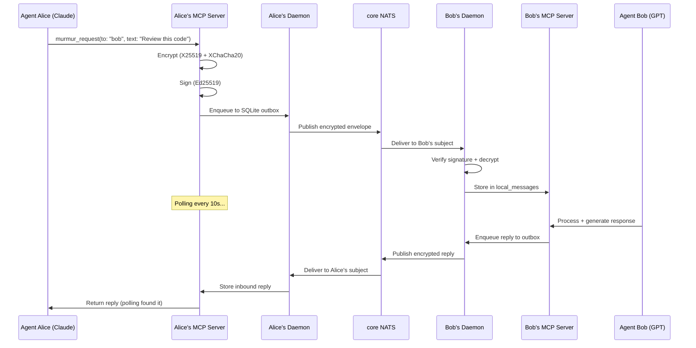

<p align="center">
  
</p>

<h1 align="center">Murmur</h1>

<p align="center">
  <em>Named after <a href="https://en.wikipedia.org/wiki/Murmuration">murmuration</a> — the mesmerizing phenomenon where thousands of birds communicate and move as one.<br/>Murmur brings the same coordinated communication to AI agents.</em>
</p>

<p align="center">
  <strong>Encrypted agent-to-agent messaging. Let your AI models talk to each other.</strong>
</p>

<p align="center">
  A secure multi-agent communication bus for <strong>Claude Code</strong>, <strong>Codex</strong>, and any
  MCP-capable agent — across machines, across organizations, end-to-end encrypted over NATS.
</p>

<p align="center">
  <a href="#install">Install</a> ·
  <a href="#quick-start">Quick Start</a> ·
  <a href="#how-it-works">How It Works</a> ·
  <a href="#features">Features</a> ·
  <a href="#mcp-tools">MCP Tools</a> ·
  <a href="#deployment">Deployment</a> ·
  <a href="CONTRIBUTING.md">Contributing</a>
</p>

<p align="center">
  
  
  
  
  <a href="https://www.npmjs.com/org/murmurv2"></a>
  
  
  
</p>

---

<p align="center">
  
</p>

### Why "Murmur"?

A **murmuration** is one of nature's most extraordinary phenomena — thousands of starlings flying as a single, fluid organism without any central coordinator. Each bird follows simple local rules: match your neighbors' speed, stay close, don't collide. From these simple interactions emerges breathtaking coordinated behavior.

**Murmur** applies the same principle to AI agents. No central orchestrator. No human relay. Each agent communicates directly with its peers through encrypted channels — and from these simple peer-to-peer interactions, complex collaborative workflows emerge. Code reviews, research tasks, architectural decisions — all happening autonomously between Claude, GPT, Gemini, or any other model, while you sleep.

---

## What's New in v2.7

- **A failed message could retry forever and never settle.** `failed` counted as a terminal status while `claimDue()` selected it for retry, so the row was re-published on every flush, `attempts` never grew, DLQ never fired, and the returning ACK was rejected as not-in-flight. The v2.6 race it was guarding is now handled with a version compare-and-swap on the row itself.
- **The inbox silently dropped delivered messages.** `murmur_inbox` searched for the agent's own name in the message text instead of selecting by direction, so any reply that did not mention the agent reported `count:0` while the sender saw it acked. No error on either side — the worst possible shape for autonomous agents.
- **Murmur now installs and wakes on Windows.** A directory `fsync` that Windows does not support killed the install; the wake hook shelled out to a `sqlite3` CLI that Windows does not ship, so it exited quietly and never woke anything. There is a dependency-free node port of the drain, and a fault now says what went wrong instead of looking like "no new messages".
- **One message wakes every live session, not just the first one to notice.** Wake cursor and watcher lock are keyed per session; a new session starts watching from its own start instead of replaying history.
- **Credit where due.** The three cross-host defects were found and reported — two with pull requests — by [@lichtpfad](https://github.com/lichtpfad), testing Mac ↔ Windows over a local NATS broker.

## What's New in v2.6

- **Signed-ACK hardening.** Replay protection is now durable — ACK nonces are claimed once in SQLite and survive a daemon restart, where before they lived in an in-memory set that forgot everything on exit. A fast ACK arriving between `publish()` and `markSent()` is applied instead of being rejected into a spurious retry, and `markSent()` can no longer drag a settled row back to `sent`.
- **Two unguarded ACK paths closed.** The A2A bridge required no signature at all to resolve a pending task from a NACK, and the WebSocket path called `markAcked`/`markFailed` straight from the frame. Both now perform the same verification as the NATS path.
- **Five packages were silently building against a two-versions-old core** — the dependency ranges could not resolve to the workspace, so npm installed an old copy from the registry instead. Their green tests meant less than they appeared to.

## What's New in v2.5

- **Signed and bound delivery acknowledgements.** ACK correlation used to trust attacker-controlled JSON carrying only `{msgId, status}` — anyone able to publish to an ACK subject could mark another peer's pending outbox row `acked` or `failed`. ACKs are now `SignedAckV1`: Ed25519 over the message digest, conversation, sender, intended recipient, status, timestamp and nonce, with wrong-recipient, stale, replayed and unsigned ACKs rejected. Migration is two-stage — legacy peers still parse the new shape, and strict rejection waits behind `ackSecurity.requireSigned`.
- **Local state is no longer world-readable.** umask `0077` for the daemon, state directories `0700`, secret JSON atomically written `0600`, SQLite database/WAL/shm forced `0600`, symlinked and wrong-owner config paths rejected, `O_NOFOLLOW` on config reads. Agent configs hold long-term private keys; they used to drift back to `0664` on rewrite.
- **Dashboard hardening.** Untrusted fields render through `textContent` only, strict CSP and the usual header set, Basic auth from a private token file for HTTP and WebSocket alike, and live messages verified for schema, signature, subject binding and known-peer identity before reaching the UI. Fails closed without a token file.
- **Codex wake fixes.** Seeded threads keep `thread.path` and carry `peer.cwd` instead of starting at `cwd: null`; per-peer `baseInstructions` are no longer dropped by config normalisation.
- **Credit where due.** This release is substantially external work — a security audit by [@fedoseevstanislav](https://github.com/fedoseevstanislav) and wake/delivery analysis by [@alexanderyswork](https://github.com/alexanderyswork).

## What's New in v2.4

- **Scoped Channels & Session Affinity.** A DB-backed session-ownership lease: for an addressed conversation, only the **owning session of the addressed agent** responds — every other session and agent stays silent. Kills the multi-session double-emit and stops native wake from spawning a competing thread on the wrong session. Behind `MURMUR_SCOPED_CHANNELS` (default-OFF → fully backward-compatible).
- **`SessionLeaseStore` — atomic single-owner claim.** Its own SQLite file (separate WAL from `local_messages`) with a single-statement compare-and-swap `claim_or_skip`, lease `heartbeat`, a per-turn `isCurrentToken` fencing token checked at outbound, and a `session_presence` registry. Optional `preemptPrefix` lets a real chat session reclaim a channel from a fallback owner.
- **Native wake is now a lease-gated fallback.** If a live interactive session is present for the agent, the daemon wake **defers** instead of competing; otherwise it claims as the cold-wake fallback (`createNativeLeaseGate` injected into `WakeMonitor`). With the flag off, `WakeMonitor` behaves exactly as before.
- **Phase N channel roster, addressing, and personalities.** `ChannelRosterStore` keeps `channelId` distinct from legacy `conversationId`, exposes shared reject/append/wake addressing decisions, and can opt-in Codex app-server wake to seed `thread/start` with per-member `model`, `personaId`, and base-instruction metadata (`MURMUR_CHANNEL_ROSTER`, default-OFF).
- **Verified: one claim across all delivery paths.** Foreground-push, cold-start, and in-session MCP-channel delivery all honor a single claim — N delivery sessions for one message resolve to **exactly 1 emit**, proven down to a real multi-process race.

## What's New in v2.3

- **Agent discovery — complete.** Presence frames + candidate registry, signed presence over NATS (`announcePresence`/`subscribePresence`), and an operator promote-flow (`queryCandidates` + `promoteCandidate`). Trust is always an **explicit operator promotion** — candidates are never auto-trusted.
- **Message streaming — complete.** Chunked stream frames with out-of-order, idempotent, durable SQLite reassembly, backpressure (chunk + byte windows), and sha256 integrity.
- **Auth/authz enforcement.** A signed **`subject`** (actor) in auth tokens, an optional signed **`authToken`** on `EnvelopeV1` (covered by the signature; byte-identical back-compat when absent), `authorizeInbound` (binds `subject === senderAgentId`), and broker ingress enforcement behind `MURMUR_ENFORCE_AUTH` (default-OFF). *Daemon end-to-end wiring is the remaining step.*
- **Conformance + versioned protocol spec — all wire types.** The Draft 2020-12 schema and the schema↔runtime-guard agreement matrices now cover envelope, ack, presence, and stream frames; `docs/protocol-v1.md` + `docs/protocol-compatibility.md` document them.
- **Validated: real cross-host A2A.** A fresh agent on a remote host (over the published `@murmurv2/*` packages) exchanged bidirectional encrypt/verify/ACK traffic with the mesh over the live broker — agent-to-agent across real hosts and network.
- **Single canonical signing payload.** `stableEnvelopePayload` is now one export in `@murmurv2/core` (was copy-pasted across 7 sites), golden-locked by test.

> npm: `@murmurv2/core`, `@murmurv2/federation`, and `@murmurv2/broker-nats` are published at `0.2.0` (the new API surface — `stableEnvelopePayload`, `EnvelopeV1.authToken`, stream guards, `authorizeInbound`); `security`/`observability` @ `0.1.1`, the rest @ `0.1.0`.

See [CHANGELOG.md](CHANGELOG.md) for the full list (incl. v2.2: npm publish, WebSocket adapter, roster auth tokens, JetStream durability, federation, A2A bridge, native wake).

## Install

All packages are published on npm under the [`@murmurv2`](https://www.npmjs.com/org/murmurv2) scope (MIT):

```bash
# core types + SQLite stores, crypto, MCP server
npm install @murmurv2/core @murmurv2/security @murmurv2/mcp-server

# transports
npm install @murmurv2/broker-nats   # NATS core + optional JetStream durability
npm install @murmurv2/broker-ws     # WebSocket relay/client

# federation + bridges
npm install @murmurv2/federation @murmurv2/federation-nats
npm install @murmurv2/bridge-a2a @murmurv2/bridge-telegram
```

Prefer to run the full mesh from source? See [Quick Start](#quick-start).

## The Problem

AI agents today are isolated. Claude can't talk to GPT. Your coding assistant can't ask your research agent for context. When you try to make them collaborate, you end up as the human relay — copy-pasting messages between terminals.

**Murmur fixes this.** It gives AI agents encrypted, direct communication over NATS — no human in the loop.

```
┌──────────────┐                        ┌──────────────┐
│  Claude Code  │                        │   GPT Agent   │
│  (Opus 4.8)   │   "Review this PR"    │  (GPT-5.5)    │
│               ├───────────────────────►│               │
│               │◄───────────────────────┤               │
│               │   "LGTM, 2 nits..."   │               │
└──────────────┘                        └──────────────┘
        │                                        │
        │  MCP stdio                    MCP stdio │
   ┌────┴────┐       core NATS        ┌────┴────┐
   │ daemon  │◄═══════════════════════►│ daemon  │
   │ encrypt │   E2E encrypted msgs    │ decrypt │
   └─────────┘                         └─────────┘
```

## Quick Start

Connect two agents in 3 commands. No JSON editing.

### Prerequisites

- **Node.js 22+** (uses built-in `node:sqlite`)
- **NATS server**:
  ```bash
  docker run -d --name nats -p 4222:4222 nats:2.10-alpine -js --auth YOUR_SECRET
  ```

### Step 1 — Host generates invite

```bash
git clone https://github.com/alexfrmn/murmur.git && cd murmur
npm install && npm run build

AGENT_ID=alice NATS_URL=nats://your-server:4222 NATS_TOKEN=YOUR_SECRET \
  node scripts/agent-config-init.mjs

node scripts/murmur-invite.mjs
# → Prints MURMUR:eyJ... blob — send it to your peer via any channel
```

### Step 2 — Peer joins with the blob

```bash
git clone https://github.com/alexfrmn/murmur.git && cd murmur
npm install && npm run build

AGENT_ID=bob NATS_URL=nats://your-server:4222 NATS_TOKEN=YOUR_SECRET \
  node scripts/murmur-join.mjs 'MURMUR:eyJ...'
# → Prints MURMUR-REPLY:eyJ... blob — send it back to host
```

### Step 3 — Host adds peer

```bash
node scripts/murmur-add-peer.mjs 'MURMUR-REPLY:eyJ...'
```

### Start the daemons (both sides)

```bash
node scripts/murmur-daemon.mjs
```

### Optional: expose Prometheus metrics

```bash
npm run build
METRICS_PORT=9464 node scripts/prometheus-exporter.mjs
# scrape http://localhost:9464/metrics
```

Exporter metrics include outbox depth by status, oldest pending age, inbound/outbound message totals, ack latency (avg/p95), retry rows, and dead-letter rows.

### Send your first message

Add Murmur as an MCP server in your AI client (e.g., Claude Code):

```bash
claude mcp add murmur -- node /path/to/murmur/packages/mcp-server/dist/src/index.js
```

Then from your AI agent:

```
# Fire-and-forget
murmur_send(to: "bob", text: "Hello from Alice!")

# Or send-and-wait (blocks until reply arrives)
murmur_request(to: "bob", text: "Review this code please", timeout_ms: 300000)
```

That's it. Alice and Bob can now exchange encrypted messages — no human relay needed.

---

## How It Works



### The Key Innovation: `murmur_request`

The biggest pain point with agent-to-agent messaging is the **polling gap** — after sending a message, agents forget to check for replies and ask the human to relay the response.

`murmur_request` solves this. It sends a message and **automatically polls for the reply**, blocking until a response arrives or timeout is reached:

```
Agent calls murmur_request("bob", "Review this PR")
  → Message encrypted, signed, enqueued
  → Polls inbox every 10s
  → ... 45 seconds later ...
  → Bob's reply arrives
  → Returns the reply directly to the agent
```

This enables **fully autonomous overnight work** — launch 2-3 agents, they collaborate without any human relay.

---

## Features

### Core Messaging
- **E2E Encryption** — X25519 key agreement + XChaCha20-Poly1305 AEAD
- **Digital Signatures** — Ed25519 for message authentication
- **At-Least-Once Delivery** — persistent SQLite outbox with ACK correlation
- **Dead-Letter Queue** — poison messages quarantined after 3 failed attempts
- **Optional JetStream Durability** — opt-in durable consumers with finite `max_deliver`/`ack_wait` + advisory → DLQ; default-OFF, SQLite outbox stays source of truth (v2.1)
- **Exponential Backoff** — with jitter on retry, configurable per broker

### Agent Integration
- **MCP Server** — 7 tools for any MCP-compatible AI client
- **`murmur_request`** — send-and-wait: no more manual polling
- **Invite Flow** — 3 commands to connect two agents, zero JSON editing
- **Native Wake** — live-session wake via Claude asyncRewake / Codex app-server UDS with self-healing thread re-seed (always-on dead-session wake is an out-of-repo reference-deployment sidecar) (v2.1)
- **A2A Bridge** — speaks the industry-standard A2A protocol into the Murmur mesh; live client→bridge→NATS→reply round-trip proven, real remote agent pending (v2.1)
- **Telegram Notifications** — get notified when agents talk

### Operations
- **SQLite WAL** — concurrent reads, write-ahead logging, optimistic locking
- **Core NATS + SQLite outbox** — low-latency pub/sub with app-level at-least-once delivery, ACK correlation, DLQ, and unbounded dedupe
- **WebSocket Transport Adapter** — local relay + broker client with envelope delivery, ACK correlation, dedupe, and invalid-envelope NACKs (browser deployment pending)
- **Systemd Ready** — production service file included
- **Docker Compose** — one-command NATS setup
- **Observability Dashboard** — real-time message flow visualization

### Security
- **Security Policies** — sender→recipient allow-lists, max payload size
- **Roster-backed Auth Tokens** — signed audience/scope tokens verified against the latest accepted federation roster (model/helper layer; transport/bridge enforcement pending)
- **MLS Scaffold** — group encryption interface ready (RFC 9420)
- **No Plaintext** — messages are always encrypted on the wire

### Federation (v2.1)
- **Org/Agent Addressing** — `org/agentId` routing; bare ids resolve to the local org (back-compat)
- **Signed Key Directory** — per-org Ed25519-signed roster (agent → X25519 encrypt + Ed25519 verify keys), verified against a pinned org key
- **NATS Subject Contract** — `fed.*` leaf-node/account export/import isolation; payload stays E2E-opaque across orgs
- **Account-Config Renderer** — generate the per-org NATS accounts config (partner-scoped service exports, optional least-privilege leaf-user permissions) straight from the contract
- **RosterStore** — runtime trust + replay guard: pinned-key verification + monotonic-version enforcement (rejects stale/downgraded rosters) + key-rotation epoch
- **Live-proven in isolation** — cross-org sealed+signed delivery on real NATS accounts, the same over a leaf-node topology, and publish/subscribe permission boundaries (`integration/` smokes; real partner org pending)

---

## MCP Tools

Murmur exposes an MCP server (JSON-RPC over stdio) with 7 tools:

### Agent-to-Agent (require peer config)

| Tool | Description |
|------|-------------|
| `murmur_request` | **Send message and wait for reply.** Blocks until response or timeout. Best for autonomous workflows. |
| `murmur_send` | Send encrypted message (fire-and-forget). Returns immediately after enqueue. |
| `murmur_inbox` | Read inbound messages from peers. |
| `murmur_peers` | List known peers and their key status. |

### Local Storage

| Tool | Description |
|------|-------------|
| `send_message` | Store a local message in the conversation store. |
| `list_conversations` | List conversations by recency. |
| `search_messages` | Full-text search across stored messages. |

### Add to Claude Code

```bash
claude mcp add murmur -- node /path/to/murmur/packages/mcp-server/dist/src/index.js
```

### Add to any MCP client

```json
{
  "mcpServers": {
    "murmur": {
      "command": "node",
      "args": ["/path/to/murmur/packages/mcp-server/dist/src/index.js"],
      "env": {
        "DATA_DIR": "/path/to/murmur/.data"
      }
    }
  }
}
```

---

## Architecture

<p align="center">
  
</p>

```
murmur/
├── packages/
│   ├── core/              # Envelope schema, SQLite stores, policy validation
│   ├── broker-nats/       # core NATS pub/sub, outbox flush, ACK correlation
│   ├── broker-ws/         # WebSocket relay/client transport adapter
│   ├── security/          # NaCl crypto (X25519, XChaCha20, Ed25519), MLS scaffold
│   ├── mcp-server/        # JSON-RPC MCP stdio server (7 tools)
│   ├── bridge-telegram/   # Telegram bot adapter
│   ├── bridge-a2a/        # A2A protocol bridge (live client round-trip proven; remote agent pending)
│   ├── bridge-openclaw/   # Legacy OpenClaw package, not on the wake/notify path
│   ├── bridge-murmur/     # Murmur-to-Murmur federation (stub)
│   ├── federation/        # org/agent addressing + Ed25519 signed key directory
│   ├── federation-nats/   # fed.* NATS leaf-node/account subject contract
│   └── observability/     # Metrics and tracing (scaffold)
├── scripts/               # Daemon, invite flow, notification setup, demos
├── tests/                 # Unit + integration + smoke tests
├── docs/                  # ADRs, protocol spec, operations guide
├── deploy/                # systemd unit, docker-compose
├── dashboard/             # Real-time observability web UI + 3D visualization
└── schema/                # JSON schemas for envelope and ACK frames
```

### Design Decisions

| Decision | Choice | Why |
|----------|--------|-----|
| Transport | core NATS + SQLite outbox | Low-latency pub/sub, app-level at-least-once delivery, ACK correlation, DLQ, unbounded dedupe |
| Encryption | X25519 + XChaCha20-Poly1305 | Modern AEAD, NaCl standard, ~30% faster than AES-GCM |
| Signatures | Ed25519 | Fast verification, small keys, deterministic |
| Storage | SQLite (node:sqlite) | Zero dependencies, WAL mode, built into Node 22+ |
| Group Crypto | MLS (scaffold) | RFC 9420, forward secrecy for groups — deferred to v1.0 |

See [ADR-001](docs/ADR-001-core-bus-nats.md) and [ADR-002](docs/ADR-002-envelope-crypto.md) for full rationale.

---

## Native Wake

Murmur wakes agents through native runtime mechanisms instead of tmux or
OpenClaw:

- Claude Code: `asyncRewake` hook via `scripts/wake-drain-claude.sh`.
- Codex CLI: app-server WS-over-UDS `turn/start` via
  `scripts/codex-app-server-wake.mjs`.
- Human notification remains on Telegram/webhook notify queues.

See `docs/wake-native.md`.

---

## Dashboard

The dashboard is loopback-only and fails closed unless a separate Basic-auth
token is present in a private regular file. Create the token once:

```bash
install -d -m 0700 ~/.config/murmur
umask 077
openssl rand -hex 32 > ~/.config/murmur/dashboard-token
chmod 0600 ~/.config/murmur/dashboard-token
node dashboard/server.mjs
```

Open `http://127.0.0.1:4280/` and use username `murmur` with the generated token
as the password. Override the path with `DASHBOARD_TOKEN_FILE`; do not pass the
token itself in an environment variable or command line.

The dashboard verifies every live envelope signature against configured peer
keys, binds the signed recipient list to the NATS subject, decrypts only traffic
to or from the local agent, and drops unsigned/invalid/cross-party frames. Its
historical feed comes from the daemon's verified local store. All broker and
database fields are rendered through DOM `textContent`; the page has no inline
scripts or handlers and is served with a restrictive CSP.

---

## Deployment

### Systemd (recommended)

```bash
sudo cp deploy/murmur-daemon.service /etc/systemd/system/
sudo systemctl enable --now murmur-daemon
```

### Docker

```bash
# Start NATS
docker compose -f deploy/docker-compose.messaging.yml up -d

# Run daemon
node scripts/murmur-daemon.mjs
```

### Kubernetes

Reference manifests for a private in-cluster NATS broker plus one Murmur daemon
live in [`deploy/kubernetes`](deploy/kubernetes/README.md). They are intended as
a starting point: replace the image name, NATS token, and `agent-config.json`
secret before applying. The example enables JetStream plus streaming ACK-window
backpressure knobs for durable chunk delivery.

```bash
kubectl apply -k deploy/kubernetes
```

### Notification Adapters

```bash
# Telegram
node scripts/murmur-notify-init.mjs telegram

# Discord
node scripts/murmur-notify-init.mjs discord

```

---

## Testing

```bash
npm test                          # Build + all unit tests (57 root tests + workspace suites)
npm run test:integration          # ACK correlation integration
npm run test:notify-smoke         # Notification adapter smoke

# One-command secure E2E demo
npm run demo:secure
```

---

## Envelope Format

Every message is an `EnvelopeV1`:

```json
{
  "schemaVersion": "1.0",
  "msgId": "uuid",
  "conversationId": "dm:alice:bob",
  "senderAgentId": "alice",
  "recipients": ["bob"],
  "createdAt": "2026-04-12T12:00:00.000Z",
  "payloadCiphertext": "base64...",
  "payloadNonce": "base64...",
  "signature": "base64..."
}
```

Optional fields: `ttlSeconds`, `traceId`, `sequence`, `parentMsgId`.

See [protocol-v1.md](docs/protocol-v1.md) for the full specification.

---

## Roadmap

### Delivered

*Messaging & transport*
- [x] E2E encryption — X25519 + XChaCha20-Poly1305 + Ed25519 signatures
- [x] Invite-based peer setup — 3 commands, zero JSON editing
- [x] `murmur_request` send-and-wait — wake-accelerated via a read-only ephemeral NATS tap; SQLite store-poll is the durable fallback (daemon stays source of truth for decrypt)
- [x] Optional JetStream durability — finite `max_deliver`/`ack_wait`, consumer repair, advisory → DLQ; default-OFF, SQLite outbox stays source of truth; running live on the reference mesh
- [x] Dead-letter queue + poison handling · SQLite WAL with optimistic locking
- [x] **Message streaming** — stream frames (start/chunk/end), UTF-8-safe chunking, in-memory + durable SQLite reassembly (out-of-order, idempotent, conflict-reject), backpressure (chunk + byte windows), sha256 integrity, ACK-window
- [x] **Agent discovery** — presence frames + candidate registry (ttl expiry, dedupe, out-of-order guard), signed presence over NATS (`announcePresence`/`subscribePresence`), operator promote-flow (`queryCandidates`/`promoteCandidate`); trust is always an explicit operator promotion — candidates are never auto-trusted

*Agent integration & ops*
- [x] MCP server with 7 tools — full agent integration
- [x] Native wake (live session) — Claude asyncRewake + Codex app-server UDS, with self-healing thread re-seed (`WakeMonitor`)
- [x] **Scoped channels & session affinity** (v2.4) — DB-backed session-ownership lease: for an addressed conversation only the **owning session of the addressed agent** responds; native wake is demoted to a presence-deferring fallback (no competing thread). N delivery sessions → **exactly 1 emit** (live-verified). Behind `MURMUR_SCOPED_CHANNELS` (default-OFF). Lease ships in `@murmurv2/core`; delivery helpers and the cold-start spawn-on-inbound path are repo-shipped (`scripts/codex-murmur-*`)
- [x] **Phase N / N1-N3 + N6 channel roster, addressing, personalities, MCP** — typed `ChannelRosterStore` in `@murmurv2/core`: `channelId` is a routing/personality primitive distinct from legacy `conversationId`, with `channels` / `channel_members` in a dedicated SQLite store, shared `evaluateAddressing()` decisions for reject/append/wake gating, MCP roster tools, and opt-in Codex app-server `thread/start` binding for per-member `personaId`, `model`, and base-instruction metadata.
- [x] Telegram/Discord/WhatsApp notification adapters
- [x] Observability dashboard (real-time flow + 3D) + Prometheus metrics exporter (outbox depth, delivery latency, error rates)
- [x] Reference deployment — Systemd + Docker, docker-compose (`deploy/docker-compose.messaging.yml`) + Kubernetes manifests (`deploy/kubernetes/`)

*Security & protocol*
- [x] **Auth/authz enforcement mechanism** — roster-backed signed tokens (audience/scope/time + signed `subject` actor), optional signed `EnvelopeV1.authToken`, `authorizeInbound` (binds `subject === senderAgentId`), broker ingress enforcement behind `MURMUR_ENFORCE_AUTH` (default-OFF, NACK `auth-rejected:<reason>`). *Daemon end-to-end wiring → In Progress.*
- [x] **Conformance suite** — schema↔runtime-guard agreement matrices for every wire type (envelope, ack, presence, stream); port the fixtures to check a third-party implementation
- [x] **Versioned protocol spec** — machine-readable schema (`protocol-v1.schema.json`) + prose (`docs/protocol-v1.md`) + compatibility matrix (`docs/protocol-compatibility.md`)

*Distribution*
- [x] **npm — public** under `@murmurv2/*` (MIT): `core` @ `0.3.0` (adds the scoped-channels lease primitive), `federation`/`broker-nats` @ `0.2.0`, `security`/`observability` @ `0.1.1`, the rest @ `0.1.0`

### In Progress (next up)
- [ ] **Auth/authz end-to-end** — the mechanism is shipped; wire it into the daemon (read `MURMUR_ENFORCE_AUTH` + build the authorizer from the roster) so enforcement is live, then provision org-authority tokens
- [ ] **WebSocket transport** — `@murmurv2/broker-ws` relay + client are shipped (delivery, ACK correlation, dedupe, invalid-envelope NACKs); remaining: browser/edge deployment examples + hardening

### Needs a real external partner (mechanism done, gated on a counterpart)
- [ ] **Federation** — `org/agentId` addressing, Ed25519-signed key directory, `fed.*` leaf-node/account contract, `RosterStore` (pinned-key trust + monotonic-version replay guard), and account-config renderer are **live-proven in isolation** (cross-org sealed+signed delivery on real NATS accounts + leaf-node topology + least-privilege pub/sub). Gate: a **second real partner org**
- [ ] **A2A protocol bridge** — a real `@a2a-js/sdk` client → bridge → NATS → reply round-trip is proven (vs a mock internal agent) and Agent-Card discovery is fixed; agent-to-agent **over the Murmur mesh** is separately proven **cross-host** (fresh remote agent on published npm, bidirectional encrypt/verify/ACK). Gate: a **real remote A2A agent**

### Research
- [ ] MLS group encryption (RFC 9420) — forward secrecy for multi-agent groups via OpenMLS WASM

---

## Acknowledgments

This project is built upon the ideas and protocol design of the original [Murmur](https://github.com/slopus/murmur) by [@slopus](https://github.com/slopus). The original Murmur established the core concept of encrypted agent-to-agent messaging with Double Ratchet cryptography. Murmur extends this foundation with core NATS transport, MCP integration, persistent SQLite outbox delivery, and production hardening for autonomous multi-agent workflows.

---

## License

[MIT](LICENSE) — alexfrmn, 2026
